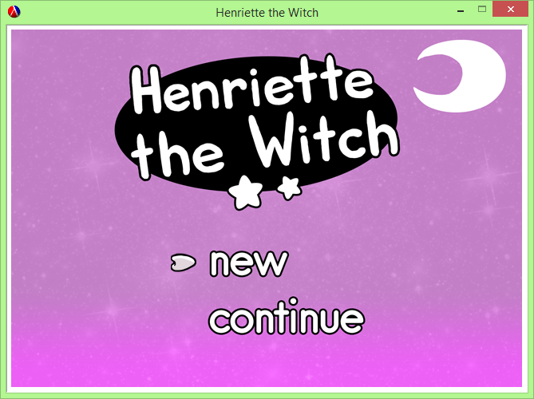

# Henriette the Witch

##Authors
Andrew Gabriel

Patrick Lehane

##Overview
Henriette the Witch is a 2D side-scroller which involves a number of mechanics such as running, jumping, shooting spells, and more!

##Screenshot
Here's the title screen to our game where you can either start a new one or continue from where you last left off:

Here's the game in action:


##Concepts Demonstrated
* **Higher Order Procedures** are used in order to add/remove sprites from the sprite list, to check for collisions between different sprites.
* We used **abstraction** when creating our sprites, tiles, and maps and the procedures needed to access elements from those “classes”.
* We also made heavy use of local bindings such as let, let*, etc. when dealing with our sprite updates.

##External Technology and Libraries
[2htdp/image](http://docs.racket-lang.org/teachpack/2htdpuniverse.html) was used to draw the game background, map, sprites, and just about everything else you see when you play the game.
[2htdp/universe](http://docs.racket-lang.org/teachpack/2htdpuniverse.html) allowed us to manipulate our sprites on every frame so that we can have a fully functional game.
[2htdp/batch-io](http://docs.racket-lang.org/teachpack/2htdpbatch-io.html) was also used when the user wanted to save their current progress in the game by grabbing the current state of the game and saving it into a text file; when the user wanted to continue we loaded the same data from the text file in order to create our world from the user’s last session.


##Favorite Lines of Code
####Andrew 
Remember code looks something like this:
```scheme
(map (lambda (x) (foldr compose functions)) data)
```
####Patrick
This expression reads in a regular expression and elegantly matches it against a pre-existing hashmap....
```scheme
(let* ((expr (convert-to-regexp (read-line my-in-port)))
             (matches (flatten
                       (hash-map *words*
                                 (lambda (key value)
                                   (if (regexp-match expr key) key '()))))))
  matches)
```


#How to Download and Run
In order to play the game, open final-project.rkt in DrRacket and run it.
To select start or continue on the title screen use the arrow keys to move and z to select.
The controls for the rest of the game are:
*z button - jump also used to select when on title screen or in pause menu
*x button - attack
*arrow keys - move player to left and right
*left shift - open pause menu

Latest Release : (x)